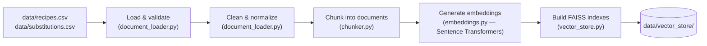
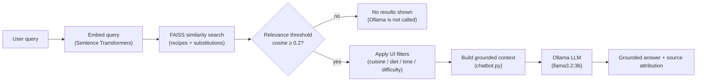

# What Can I Cook? 🍳

"What Can I Cook?" is a Retrieval-Augmented Generation (RAG) recipe assistant. It
recommends recipes based on the ingredients you have, detects what's missing from a
matched recipe, and provides ingredient substitutions and make-it-yourself suggestions.
Recommendations are produced through semantic retrieval over a local recipe and
substitution knowledge base, followed by grounded response generation using a local LLM.

## Problem statement

You have a handful of ingredients and no clear idea what to cook, or a recipe calls for
something you don't have and you don't know if there's a substitute. Generic recipe search
engines match on exact ingredient lists and don't help with substitutions. This project
solves both problems locally: semantic search finds recipes that actually fit what you
have (not just exact keyword matches), and a separate substitution knowledge base is
searched alongside it so missing ingredients come with real, sourced alternatives.

## Demo

🎥 **Watch the application demo:** https://www.awesomescreenshot.com/video/56522781?key=84e428d07d1842c37f8c8ea32c3b5252


## Key features

- 🔍 **Ingredient-based recipe recommendations** — describe what you have in plain language
  or a comma-separated list; semantic search finds the best-fitting recipes, not just exact
  keyword matches
- ❌ **Missing ingredient detection** — every matched recipe shows exactly what you have and
  what you're missing
- 🔄 **Ingredient substitutions** — missing something? The app looks for a real substitution
  entry in the knowledge base (e.g. butter → ghee)
- 🧑‍🍳 **Make-it-yourself suggestions** — some substitutions are full recipes in themselves
  (e.g. paneer → full-fat milk + lemon juice, with method and notes)
- 🥗 **Dietary filters** — Any / Vegetarian / Vegan
- ⏱️ **Cooking time, difficulty & cuisine filters** — Any / Under 15 / 30 / 60 min · Any /
  Easy / Medium · Any / Indian / Italian / Asian
- 📚 **Source attribution** — every AI-generated answer lists exactly which retrieved
  recipes/substitutions it's based on, so the answer is never a black box
- 🎯 **Relevance threshold** — a minimum cosine-similarity score (see Architecture below)
  filters out irrelevant matches; if nothing clears it, the app says so honestly instead of
  forcing a bad recommendation

## Architecture: how the RAG pipeline works

The pipeline runs in two distinct phases: a **one-time indexing step** (build the knowledge
base into a searchable index) and a **per-query step** (what happens every time you search).

### 1. Knowledge base build (run once, or whenever the CSVs change)



### 2. Query flow (every time you search)



Both FAISS indexes (recipes and substitutions) are searched on every query, so a single
question like *"I have milk and lemon, can I make paneer?"* can surface both matching
recipes **and** a relevant substitution entry in the same answer.

## Tech stack

| Component | Library | Version |
| --- | --- | --- |
| UI | Streamlit | 1.63.0 |
| Data handling | pandas | 2.3.3 |
| Embeddings | Sentence Transformers (`all-MiniLM-L6-v2`) | 6.0.1 |
| Vector search | FAISS (`faiss-cpu`) | 1.15.0 |
| Local LLM | Ollama (`llama3.2:3b`) | client 0.6.2 |
| Config | python-dotenv | 1.0.1 |
| Testing | pytest | 8.3.5 |

## Project structure

```
what-can-i-cook-rag/
├── app.py                    Streamlit UI - the only entry point you run
├── requirements.txt
├── .env.example               copy to .env to override defaults (optional)
├── data/
│   ├── recipes.csv            30 recipes
│   ├── substitutions.csv      20 substitution / make-at-home entries
│   └── vector_store/          generated by the build step below - gitignored
├── src/
│   ├── config.py               paths, model names, retrieval settings
│   ├── document_loader.py      load, validate, clean, normalize the CSVs
│   ├── chunker.py               turn rows into one RAG document each
│   ├── embeddings.py            local Sentence Transformers embeddings
│   ├── vector_store.py          build, persist and search the FAISS indexes
│   ├── retriever.py             semantic retrieval (retrieve())
│   └── chatbot.py               grounded prompt assembly + Ollama call
└── tests/                      103 automated tests (pytest)
```

## Dataset / knowledge base

Both knowledge bases are plain CSV files, loaded with pandas — no database required.

- **`data/recipes.csv`** — 30 recipes. Columns: `recipe_id`, `recipe_name`, `ingredients`,
  `instructions`, `cuisine`, `diet`, `cooking_time_minutes`, `difficulty`, `meal_type`.
- **`data/substitutions.csv`** — 20 substitution / make-at-home entries. Columns:
  `substitution_id`, `missing_ingredient`, `alternative`, `method`, `notes`.

Editing either CSV and rebuilding the index (see below) is enough to change what the app
knows — no code changes needed.

## Local setup

```bash
python -m venv .venv
.venv\Scripts\activate        # Windows
# source .venv/bin/activate   # macOS / Linux

pip install -r requirements.txt

copy .env.example .env        # Windows
# cp .env.example .env        # macOS / Linux
```

The embedding model (Sentence Transformers) downloads automatically on first use, as long
as your machine can run PyTorch (on Windows this needs the
[Microsoft Visual C++ Redistributable](https://aka.ms/vs/17/release/vc_redist.x64.exe) if
it isn't already installed).

## Ollama setup (required for AI-generated answers)

This project uses [Ollama](https://ollama.com) to serve the language model locally. Ollama
exposes a local HTTP API (default `http://localhost:11434`) that `src/chatbot.py` calls
through the `ollama` Python client.

```bash
# 1. Install Ollama: https://ollama.com/download
# 2. Pull the exact model this project uses:
ollama pull llama3.2:3b
```

`.env` only needs to override `.env.example`'s defaults if you want a different model or a
non-default Ollama host — it's optional otherwise.

## Build the FAISS index

One-time step, before real search works (re-run it whenever the CSVs change):

```bash
python -c "from src.vector_store import build_knowledge_base_index; build_knowledge_base_index()"
```

This embeds every recipe and substitution and persists two FAISS indexes under
`data/vector_store/` (gitignored — each machine builds its own).

## Run the application

```bash
streamlit run app.py
```

The app opens at http://localhost:8501.

## Run tests

```bash
pytest tests/ -v
```

**Verified result: 103 passed, 0 failed** (with a working local PyTorch install and the
FAISS index built — see Limitations below for the one system dependency this relies on).

## Example queries

These are the exact example questions built into the app's UI:

- *"I have potatoes and onions"*
- *"What can I make with paneer?"*
- *"I have rice and vegetables"*
- *"Give me something quick under 20 minutes"*

Also verified end-to-end during development:

- *"I have paneer, onion and tomato. What can I cook?"* → correctly recommended Palak
  Paneer with an accurate missing-ingredient list
- *"I have milk and lemon. Can I make paneer?"* → correctly retrieved and explained the
  paneer-from-milk-and-lemon-juice substitution

## Limitations / Future improvements

**Current limitations:**

- Embeddings require a working local PyTorch install; if it can't load (e.g. a missing
  system dependency on Windows), the app shows a clear error instead of crashing
- Substitution recall depends on what the same query retrieved — if no relevant
  substitution document was retrieved for a missing ingredient, none is shown, rather than
  falling back to a separate lookup
- The cuisine filter's "Asian" option currently only covers Chinese recipes in the dataset;
  Mediterranean and Continental recipes are only reachable via "Any"
- Single-turn only — the app does not maintain conversation history between searches

**Future improvements (NOT IMPLEMENTED):**

- Multi-turn conversation / follow-up questions
- User accounts or saved/favorite recipes
- Broader cuisine and dietary coverage in the dataset
- Empirically-calibrated relevance threshold (the current 0.2 cosine-similarity cutoff is a
  reasonable starting default, not tuned against real usage data)

This project does not include deployment, cloud hosting, or CI/CD — it is designed to be
run locally.

## License

No license has been added to this repository. All rights reserved by the author; this
project is provided for assignment/demonstration purposes only, not for reuse or
redistribution.

---

Repository: [what-can-i-cook-rag](https://github.com/pritibodgal1/what-can-i-cook-rag)
